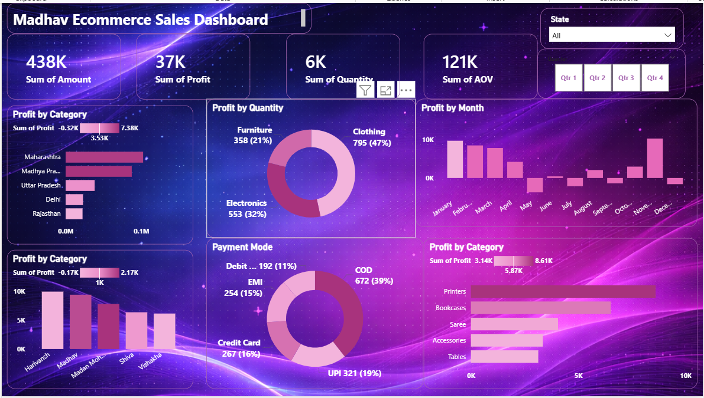

# Madhav Ecommerce Sales Dashboard (Power BI)

This project is an interactive Power BI dashboard developed to analyze and visualize ecommerce sales performance. It provides meaningful business insights using data modeling, DAX, and advanced visualizations.

---

## Project Overview

The dashboard focuses on:

- Total Sales and Profit Analysis  
- Monthly Performance Tracking  
- Category-wise Profit Distribution  
- State-wise Sales Insights  
- Customer Purchase Trends  
- Payment Mode Analysis  
- Average Order Value (AOV)

It helps in understanding business growth and identifying improvement areas.

---

## Project Learnings

- Created interactive dashboard to track and analyze online sales data  
- Used complex parameters to drill down in worksheets and customize reports using filters and slicers  
- Built relationships, joined multiple tables, and created calculated measures  
- Implemented user-driven parameters for dynamic visualizations  
- Designed multiple customized charts and visuals for better insights  

---

## Key Features

- Dynamic KPIs (Sales, Profit, Quantity, AOV)  
- Category-wise and Product-wise Analysis  
- Monthly Profit Trend  
- Payment Mode Distribution  
- Interactive Filters and Slicers  
- Clean and Professional UI Design  

---

## Dashboard Preview

